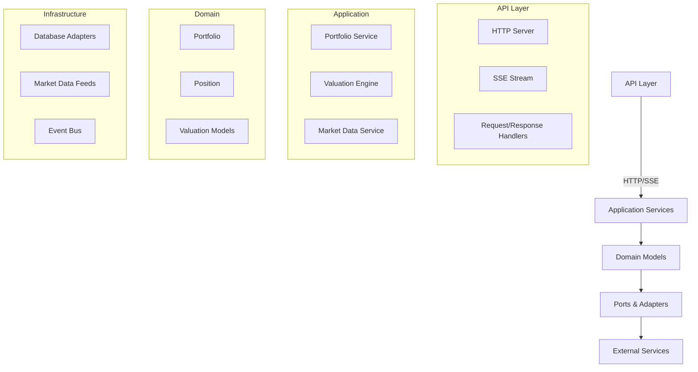

# 📊 Valuation Service

A high-performance, real-time portfolio valuation service built with Rust, Axum, and Tokio. This service provides RESTful APIs for portfolio management and real-time updates via Server-Sent Events (SSE).

## ✨ Features

- **Real-time Updates**: Live portfolio valuation updates using Server-Sent Events (SSE)
- **RESTful API**: Intuitive HTTP endpoints for portfolio management
- **High Performance**: Built on Axum and Tokio for maximum throughput and low latency
- **CORS Ready**: Pre-configured for seamless web frontend integration
- **Type Safety**: Strongly-typed Rust backend for reliability
- **Asynchronous**: Non-blocking I/O for handling thousands of concurrent connections
- **Modular Design**: Clean architecture for easy maintenance and extension

## 🚀 Getting Started

### Prerequisites

- Rust 1.65+ (install via [rustup](https://rustup.rs/))
- Cargo (Rust's package manager)

### Installation

```bash
# Clone the repository
git clone https://github.com/yourusername/valuation-service.git
cd valuation-service

# Build in release mode
cargo build --release

# Run the service
cargo run --release
```

The service will be available at `http://localhost:3000`

## 📚 API Reference

### Base URL
All API endpoints are relative to `http://localhost:3000`

### Authentication
This service currently doesn't require authentication. For production use, consider adding API keys or JWT authentication.

### Endpoints

#### Portfolio Management

##### Get Portfolio Valuation
```http
GET /portfolio
```

**Response**
```json
{
  "total_value": 50000.0,
  "positions": [
    {
      "symbol": "AAPL",
      "quantity": 10,
      "price": 185.0,
      "value": 1850.0
    },
    {
      "symbol": "MSFT",
      "quantity": 5,
      "price": 300.0,
      "value": 1500.0
    }
  ]
}
```

##### Update Stock Price
```http
POST /update-price
```

**Request**
```http
Content-Type: application/json

{
  "symbol": "AAPL",
  "price": 190.50
}
```

**Response**
```
200 OK
```

#### Real-time Updates

##### SSE Stream
```http
GET /stream
```

**Headers**
```
Accept: text/event-stream
Cache-Control: no-cache
Connection: keep-alive
```

**Example Event**
```
event: update
data: {"symbol":"AAPL","price":190.5,"timestamp":"2025-08-17T20:30:00Z"}

```

#### System

##### Health Check
```http
GET /health
```

**Response**
```
200 OK
```

## 🏗️ Architecture

The service follows a clean architecture with clear separation of concerns:



### Key Components

- **API Layer**: Handles HTTP/SSE communication
- **Application Services**: Implements business logic
- **Domain Models**: Core business entities and rules
- **Infrastructure**: External integrations and persistence

## 🛠 Development

### Prerequisites

- Rust 1.65+
- Cargo
- Docker (optional, for containerized deployment)

### Building

```bash
# Debug build
cargo build

# Release build (recommended for production)
cargo build --release
```

### Running Locally

```bash
# Start the server
cargo run --release

# Server will be available at http://localhost:3000
```

### Environment Variables

Configure the service using `.env` file:

```env
PORT=3000
RUST_LOG=info
ENVIRONMENT=development
```

## 🧪 Testing

Run the test suite:

```bash
# Run all tests
cargo test

# Run tests with detailed output
cargo test -- --nocapture

# Run a specific test
cargo test test_portfolio_endpoint -- --nocapture
```

### Test Coverage

Generate test coverage report:

```bash
cargo tarpaulin --out Html
```

## 🚀 Deployment

### Docker

Build and run using Docker:

```bash
docker build -t valuation-service .
docker run -p 3000:3000 --env-file .env valuation-service
```

### Kubernetes

Example deployment manifest:

```yaml
apiVersion: apps/v1
kind: Deployment
metadata:
  name: valuation-service
spec:
  replicas: 3
  selector:
    matchLabels:
      app: valuation-service
  template:
    metadata:
      labels:
        app: valuation-service
    spec:
      containers:
      - name: valuation-service
        image: valuation-service:latest
        ports:
        - containerPort: 3000
        envFrom:
        - configMapRef:
            name: valuation-service-config
---
apiVersion: v1
kind: Service
metadata:
  name: valuation-service
spec:
  selector:
    app: valuation-service
  ports:
  - protocol: TCP
    port: 80
    targetPort: 3000
  type: LoadBalancer
```

## 🤝 Contributing

1. Fork the repository
2. Create a feature branch (`git checkout -b feature/amazing-feature`)
3. Commit your changes (`git commit -m 'Add some amazing feature'`)
4. Push to the branch (`git push origin feature/amazing-feature`)
5. Open a Pull Request

### Code Style

- Follow Rust's official style guide
- Run `cargo fmt` before committing
- Run `cargo clippy` to catch common mistakes

## 📄 License

This project is licensed under the MIT License - see the [LICENSE](LICENSE) file for details.

## 🙏 Acknowledgments

- Built with ❤️ using [Rust](https://www.rust-lang.org/)
- Powered by [Axum](https://github.com/tokio-rs/axum) and [Tokio](https://tokio.rs/)
- Inspired by modern microservice architectures

### API Endpoints

#### Health Check
```bash
curl http://localhost:3000/health
```

#### Create Portfolio
```bash
curl -X POST http://localhost:3000/portfolios \
  -H "Content-Type: application/json" \
  -d '{"name": "My Portfolio", "base_currency": "USD"}'
```

#### Create Stock Instrument
```bash
curl -X POST http://localhost:3000/instruments/stocks \
  -H "Content-Type: application/json" \
  -d '{
    "symbol": "AAPL",
    "currency": "USD",
    "shares": 100,
    "price": 175.50,
    "volatility": 0.25,
    "dividend_yield": 0.0045
  }'
```

#### Create Option Instrument
```bash
curl -X POST http://localhost:3000/instruments/options \
  -H "Content-Type: application/json" \
  -d '{
    "underlying": "AAPL",
    "currency": "USD",
    "option_type": "call",
    "strike": 180.0,
    "expiry": "2024-12-20T00:00:00Z",
    "quantity": 10,
    "exercise_style": "european"
  }'
```

#### Add Position to Portfolio
```bash
curl -X POST http://localhost:3000/portfolios/{portfolio_id}/positions \
  -H "Content-Type: application/json" \
  -d '{
    "instrument_id": "{instrument_id}",
    "quantity": 100,
    "average_cost": 175.00
  }'
```

#### Value Portfolio
```bash
# Using Black-Scholes (default)
curl "http://localhost:3000/portfolios/{portfolio_id}/valuation"

# Using Monte Carlo
curl "http://localhost:3000/portfolios/{portfolio_id}/valuation?model=monte_carlo&include_greeks=true&include_risk_metrics=true"
```

#### Get Market Data
```bash
curl http://localhost:3000/market-data/AAPL
```

## Usage Examples

### Creating a Simple Portfolio

```rust
use valuation_service::*;

// Create portfolio
let mut portfolio = Portfolio::new("Tech Portfolio".to_string(), "USD".to_string());

// Create instruments
let aapl_stock = Stock::new("AAPL".to_string(), "USD".to_string(), 100.0);
let aapl_call = Option::new(
    "AAPL".to_string(),
    "USD".to_string(),
    OptionType::Call,
    180.0,
    Utc::now() + chrono::Duration::days(30),
    10.0,
    ExerciseStyle::European,
);

// Add positions
portfolio.add_position(aapl_stock.id().to_string(), 100.0, Some(175.00));
portfolio.add_position(aapl_call.id().to_string(), 10.0, Some(5.50));
```

### Valuing with Different Models

```rust
// Black-Scholes valuation
let bs_model = BlackScholesModel::new();
let bs_result = bs_model.value(&option, &market_context)?;

// Monte Carlo valuation
let mc_model = MonteCarloModel::new(100000, 252);
let mc_result = mc_model.value(&option, &market_context)?;
```

### Risk Analysis

```rust
let risk_engine = RiskEngine::new(0.95, 1, 10000);

// Calculate VaR
let portfolio_returns = risk_engine.simulate_portfolio_returns(1000000.0, 0.20, 0.08)?;
let var_95 = risk_engine.calculate_var(&portfolio_returns)?;

// Stress testing
let stress_scenarios = vec![
    StressScenario {
        name: "Market Crash".to_string(),
        scenario_type: StressType::MarketShock,
        shock_magnitude: -0.30,
    }
];
let stress_results = risk_engine.stress_test(1000000.0, &stress_scenarios)?;
```

## Configuration

### Market Data Providers

The service supports both mock and live market data providers:

```rust
// Mock provider (for testing)
let mock_provider = MockMarketDataProvider::new();

// Live provider (requires API key)
let live_provider = LiveMarketDataProvider::new(Some("your-api-key".to_string()));
```

### Risk Engine Settings

```rust
let risk_engine = RiskEngine::new(
    0.99,    // 99% confidence level
    10,      // 10-day time horizon
    100000   // Number of Monte Carlo simulations
);
```

## Dependencies

- **serde**: Serialization/deserialization
- **tokio**: Async runtime
- **axum**: Web framework
- **chrono**: Date/time handling
- **nalgebra**: Linear algebra
- **statrs**: Statistical functions
- **rand**: Random number generation
- **reqwest**: HTTP client

## Testing

```bash
# Run all tests
cargo test

# Run with output
cargo test -- --nocapture

# Run specific test module
cargo test models::tests
```

## Contributing

1. Fork the repository
2. Create a feature branch
3. Add tests for new functionality
4. Ensure all tests pass
5. Submit a pull request

## License

This project is licensed under the MIT License.

## Roadmap

### Planned Features
- **Additional Instruments**: Futures, swaps, exotic options
- **Advanced Models**: Heston, local volatility, jump-diffusion
- **Real-time Streaming**: WebSocket market data feeds
- **Database Integration**: Persistent storage for portfolios and historical data
- **Performance Optimization**: SIMD vectorization, GPU acceleration
- **Regulatory Reporting**: Basel III, FRTB compliance
- **Machine Learning**: AI-driven risk models and market predictions

### Performance Targets
- **Latency**: Sub-millisecond option pricing
- **Throughput**: 100K+ valuations per second
- **Scalability**: Horizontal scaling with microservices architecture
