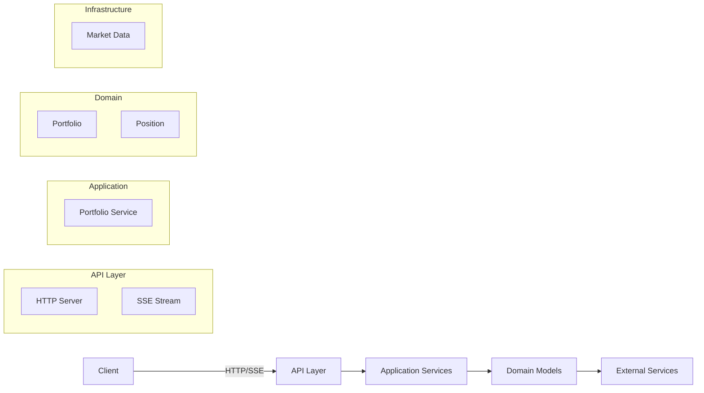

# 📊 Valuation Service

A high-performance, real-time portfolio valuation service built with Rust, Axum, and Tokio. This service provides RESTful APIs for portfolio management and real-time updates via Server-Sent Events (SSE).

## ✨ Features

- **Real-time Updates**: Live portfolio valuation updates using Server-Sent Events (SSE)
- **RESTful API**: Simple HTTP endpoints for portfolio management
- **High Performance**: Built on Axum and Tokio for maximum throughput and low latency
- **CORS Ready**: Pre-configured for seamless web frontend integration

## 🚀 Getting Started

### Prerequisites

- Rust 1.65+ (install via [rustup](https://rustup.rs/))
- Cargo (Rust's package manager)

### Installation

```bash
# Clone the repository
git clone https://github.com/yourusername/valuation-service.git
cd valuation-service

# Build in release mode
cargo build --release

# Run the service
cargo run --release
```

The service will be available at `http://localhost:3000`

## 📚 API Reference

### Base URL
All API endpoints are relative to `http://localhost:3000`

### Authentication
This service currently doesn't require authentication.

### Endpoints

#### Portfolio Management

### Position Management

#### Add Position to Portfolio
```http
POST /portfolio/positions
```

**Example Request**
```bash
curl -X POST http://localhost:3000/portfolio/positions \
  -H "Content-Type: application/json" \
  -d '{"symbol": "GOOGL", "quantity": 5, "average_cost": 2800.00}'
```

**Request Body**
```json
{
  "symbol": "string",      // Stock symbol (e.g., "AAPL", "GOOGL")
  "quantity": number,       // Number of shares
  "average_cost": number    // Optional: Average cost per share
}
```

**Example Response**
```json
{
  "position_id": "550e8400-e29b-41d4-a716-446655440000",
  "symbol": "GOOGL",
  "quantity": 5,
  "average_cost": 2800.00,
  "status": "added"
}
```

#### Get Position Details
```http
GET /portfolio/positions/{position_id}
```

**Example Request**
```bash
curl -X GET http://localhost:3000/portfolio/positions/550e8400-e29b-41d4-a716-446655440000
```

**Example Response**
```json
{
  "position_id": "550e8400-e29b-41d4-a716-446655440000",
  "symbol": "GOOGL",
  "quantity": 5,
  "average_cost": 2800.00,
  "current_value": 14000.00,
  "unrealized_pnl": 500.00,
  "entry_date": "2025-08-17T21:00:00Z"
}
```

#### Update Position
```http
PUT /portfolio/positions/{position_id}
```

**Example Request**
```bash
curl -X PUT http://localhost:3000/portfolio/positions/550e8400-e29b-41d4-a716-446655440000 \
  -H "Content-Type: application/json" \
  -d '{"quantity": 8}'
```

**Request Body**
```json
{
  "quantity": number  // New quantity for the position
}
```

**Example Response**
```json
{
  "position_id": "550e8400-e29b-41d4-a716-446655440000",
  "quantity": 8,
  "status": "updated"
}
```

#### Delete Position
```http
DELETE /portfolio/positions/{position_id}
```

**Example Request**
```bash
curl -X DELETE http://localhost:3000/portfolio/positions/550e8400-e29b-41d4-a716-446655440000
```

**Example Response**
```json
{
  "position_id": "550e8400-e29b-41d4-a716-446655440000",
  "status": "deleted"
}
```

### Portfolio Analysis

#### Get Portfolio Risk Metrics
```http
GET /portfolio/analysis/risk
```

**Example Request**
```bash
curl -X GET http://localhost:3000/portfolio/analysis/risk
```

**Example Response**
```json
{
  "portfolio_value": 1000000.0,
  "value_at_risk_1d_95": 25000.0,
  "value_at_risk_10d_95": 75000.0,
  "expected_shortfall_95": 35000.0,
  "volatility_1y": 0.2,
  "beta": 1.05,
  "sharpe_ratio": 1.2,
  "sortino_ratio": 1.5,
  "max_drawdown": 0.15,
  "last_updated": "2025-08-17T23:30:45.123Z"
}
```

#### Get Portfolio Performance Metrics
```http
GET /portfolio/analysis/performance
```

**Example Request**
```bash
curl -X GET http://localhost:3000/portfolio/analysis/performance
```

**Example Response**
```json
{
  "total_return": 150000.0,
  "total_return_percentage": 15.0,
  "annualized_return": 0.18,
  "ytd_return": 0.12,
  "monthly_returns": [0.02, 0.015, -0.01, 0.03, 0.01],
  "sharpe_ratio": 1.2,
  "sortino_ratio": 1.5,
  "alpha": 0.02,
  "beta": 1.05,
  "r_squared": 0.95,
  "tracking_error": 0.08,
  "information_ratio": 0.25,
  "max_drawdown": 0.15,
  "calmar_ratio": 1.2,
  "start_date": "2024-01-01T00:00:00Z",
  "end_date": "2025-08-17T23:30:45.123Z"
}
```

#### Get Portfolio Valuation
```http
GET /portfolio
```

**Example Request**
```bash
curl -X GET http://localhost:3000/portfolio
```

**Example Response**
```json
{
  "total_value": 50000.0,
  "positions": [
    {
      "symbol": "AAPL",
      "quantity": 10,
      "price": 185.0,
      "value": 1850.0
    },
    {
      "symbol": "MSFT",
      "quantity": 5,
      "price": 300.0,
      "value": 1500.0
    }
  ]
}
```

##### Update Stock Price
```http
POST /update-price
```

**Example Request**
```bash
curl -X POST http://localhost:3000/update-price \
  -H "Content-Type: application/json" \
  -d '{"symbol": "AAPL", "price": 190.50}'
```

**Request Body**
```json
{
  "symbol": "string",  // Stock symbol (e.g., "AAPL", "MSFT")
  "price": number      // New price for the stock
}
```

**Response**
```
200 OK
```

#### Real-time Updates

##### SSE Stream
```http
GET /stream
```

**Example Request**
```bash
curl -N http://localhost:3000/stream
```

**Headers**
```
Accept: text/event-stream
Cache-Control: no-cache
Connection: keep-alive
```

**Example Event**
```
event: update
data: {"symbol":"AAPL","price":190.5,"timestamp":"2025-08-17T20:30:00Z"}
```

#### System

##### Health Check
```http
GET /health
```

**Example Request**
```bash
curl -X GET http://localhost:3000/health
```

**Response**
```
200 OK
```

## 🏗️ Architecture

The service follows a clean, layered architecture:



### Core Components

1. **API Layer**
   - Handles HTTP/SSE communication
   - Request/response processing
   
2. **Application Layer**
   - Business logic implementation
   - Coordinates between domain and infrastructure
   
3. **Domain Layer**
   - Core business entities
   - Business rules and validations

## 🛠 Development

### Prerequisites

- Rust 1.65+
- Cargo

### Building

```bash
# Debug build
cargo build

# Release build (recommended for production)
cargo build --release
```

### Running Locally

```bash
# Start the server
cargo run --release

# Server will be available at http://localhost:3000
```

### Environment Variables

Configure the service using `.env` file:

```env
PORT=3000
RUST_LOG=info
ENVIRONMENT=development
```

## 🧪 Testing

Run the test suite:

```bash
# Run all tests
cargo test

# Run tests with detailed output
cargo test -- --nocapture

# Run a specific test
cargo test test_portfolio_endpoint -- --nocapture
```

## 🚀 Deployment

### Docker

Build and run using Docker:

```bash
docker build -t valuation-service .
docker run -p 3000:3000 --env-file .env valuation-service
```

## 🤝 Contributing

1. Fork the repository
2. Create a feature branch (`git checkout -b feature/amazing-feature`)
3. Commit your changes (`git commit -m 'Add some amazing feature'`)
4. Push to the branch (`git push origin feature/amazing-feature`)
5. Open a Pull Request

### Code Style

- Follow Rust's official style guide
- Run `cargo fmt` before committing
- Run `cargo clippy` to catch common mistakes

## 📄 License

This project is licensed under the MIT License - see the [LICENSE](LICENSE) file for details.

## 🙏 Acknowledgments

- Built with ❤️ using [Rust](https://www.rust-lang.org/)
- Powered by [Axum](https://github.com/tokio-rs/axum) and [Tokio](https://tokio.rs/)
